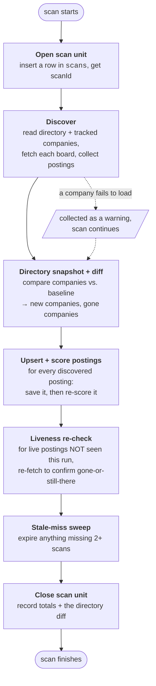
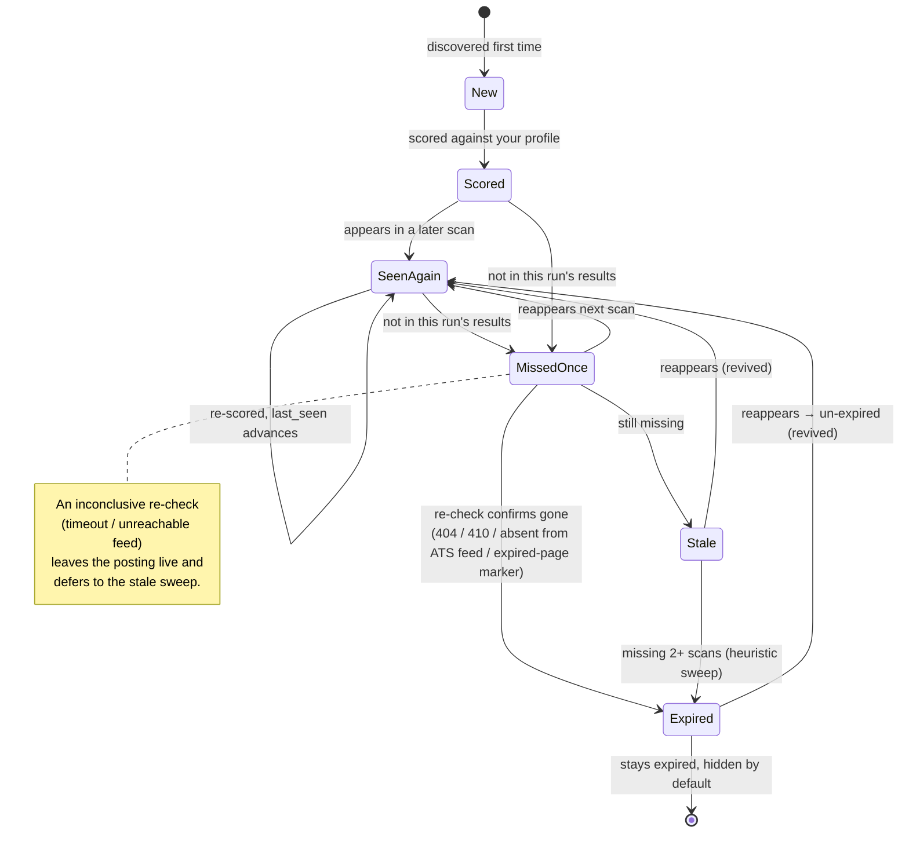
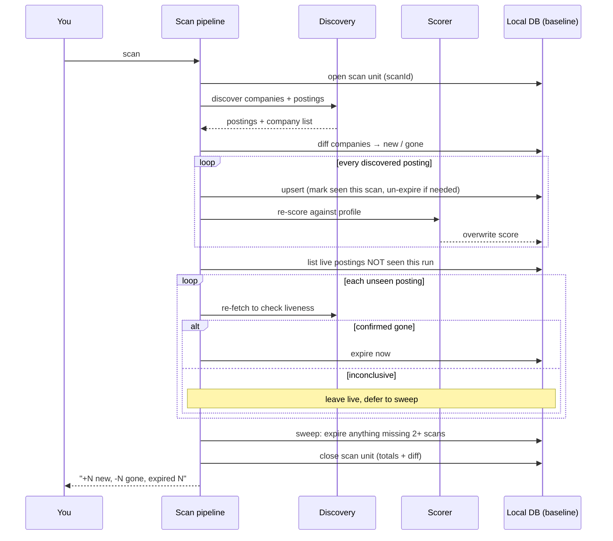

# Re-scan behavior — what happens once you have a baseline

The first `scan` populates an empty database. Every scan after that is a **re-scan**: it runs against
a baseline of companies, postings, and scores from prior runs. This guide explains what a re-scan
does differently, how postings move through their lifecycle (new → heuristic-scored → expired →
revived), and where those changes surface to you in the CLI and the dashboard.

For everyday usage, see the [getting-started guide](https://github.com/jdelgadoperez/job-hunter/wiki/Getting-Started). This doc is for understanding the *behavior*
— useful if you're wondering "why did that posting disappear?". Note that **`scan` only ever applies
the free heuristic score**; LLM deep-scoring is a separate, budget-aware `score` step (see below), so
re-scanning never re-charges your API budget.

## The short version

- By default a re-scan is **incremental**: it skips directory companies scanned within the freshness
  window (`scanFreshnessHours`, default 24h) and crawls only the rest. Companies you track yourself
  are always crawled. A **full** scan (`scan --all`, the dashboard's **Rescan all**, or
  `scanFreshnessHours = 0`) re-visits every company. See
  [Incremental scans and the freshness window](#incremental-scans-and-the-freshness-window) below —
  the full pipeline (diff, liveness, expiry) runs only on a full scan.
- A scan is recorded as a **unit** (a row in the `scans` table) tagged with its scope (`full` /
  `incremental` / `retry`). Each posting and company remembers the scan that last saw it, which is how
  the tool computes "new", "gone", and "stale".
- **Every live posting from a crawled company is heuristic-re-scored on every scan** — the free
  offline scorer, so a re-scan costs only CPU. (An incremental scan doesn't crawl fresh companies, so
  their postings aren't re-scored that run.) LLM scoring is **not** part of `scan`; it's the separate
  `score` command, which skips postings it already LLM-scored (unless `--rescore`), so it never
  silently re-charges.
- Postings that **weren't seen this run** are re-checked for liveness and expired — immediately if
  confirmed gone, otherwise after they've been missing for two or more scans.
- A posting that **reappears after being expired is revived** automatically.

## The scan pipeline

Every scan — first or hundredth — runs these phases in order. `runScan` opens a scan unit, discovers
and scores, then reconciles everything that *wasn't* seen this run.

On a **full** scan the discover and score phases treat the baseline as irrelevant — they fetch and
score whatever is live right now. (An **incremental** scan is the exception: discovery consults each
company's `last_seen_at` and skips those still inside the freshness window — see the next section.)
The interesting re-scan behavior is in the **diff**, the **liveness re-check**, and the **stale-miss
sweep**, which all compare "this run" against "what the baseline remembered".

## Incremental scans and the freshness window

By default `scan` runs **incrementally**: before crawling, it skips every **directory** company whose
`last_seen_at` is within the freshness window (the `scanFreshnessHours` setting, default **24 hours**),
crawling only the companies that have gone stale. This keeps routine scans fast when most of the
directory hasn't changed. Companies you **track yourself are always crawled**, freshness ignored — a
company you just added is scanned now.

Forcing a full re-visit:

- **CLI** — `scan --all` (ignore the window entirely) or `scan --freshness-hours N` (override the
  window for that run; `0` rescans everything).
- **Dashboard** — tick **Rescan all** beside **Scan now**.
- **Setting** — `scanFreshnessHours = 0` makes every normal scan a full scan.

An incremental scan skips only the **crawl** for fresh companies — it does **not** run the directory
diff, the liveness re-check, or the stale-miss sweep. That's deliberate and load-bearing: those phases
compare "seen this run" against the baseline, so running them on a scan that intentionally didn't
visit most companies would wrongly flag every skipped-but-healthy company as "gone" and expire its
live postings. Instead, an incremental scan is recorded with scope `incremental`, and expiry counts
only `full` scans toward the staleness clock — so **a skipped company's postings are never expired for
not being seen** on an incremental run. The scheduled auto-refresh runs incrementally for the same
reason; run a full scan periodically (or on demand) to reconcile the directory diff and expire roles
that have genuinely closed.

## How companies diff against the baseline

Each company is keyed by its careers URL and remembers the first and last scan that saw it. On a
re-scan the tool reports two deltas, relative to the **immediately preceding** scan:

| Delta | Meaning |
|---|---|
| **New companies** | In this run's directory, never recorded before. |
| **Gone companies** | Seen in the *previous* scan, absent from this one. |

"Gone" fires **once**, the first time a company disappears — a company that's been absent for several
scans is not re-reported every run. On the very first scan both deltas are empty (there's no baseline
to diff against).

## How postings are matched across scans

A posting's identity is a stable hash of `company + title + url` (lowercased). The same job discovered
on scan 1 and scan 50 gets the **same ID**, which is what lets the tool recognize a posting it has
seen before instead of treating it as new.

On save:

- **New ID** → inserted, marked seen this scan, not expired.
- **Existing ID** (a re-scan hit) → all fields refreshed, marked seen this scan, and **un-expired**
  if it had previously been expired. This is the revival path.

The prior **score is not preserved** — it's overwritten in the very next step, because scoring always
re-runs (see below).

## Scoring on a re-scan

`scan` **unconditionally re-applies the heuristic score** to every posting discovered this run — the
latest heuristic score overwrites the previous one. There's no per-posting heuristic cache, but the
heuristic is free, so re-scan cost is just CPU.

LLM deep-scoring is the separate **`score`** command, and it *does* cache: it ranks stored postings by
heuristic score, caps how many it deep-scores (`--limit`), and **skips postings already LLM-scored**
unless you pass `--rescore`. So running `scan` on a tight auto-refresh schedule never re-charges your
API budget — only an explicit `score` spends, and only on postings it hasn't scored before. Preview
the cost first with `score --dry-run`.

## The posting lifecycle

A posting moves through these states across scans. The key signal is `last_seen_scan` — the ID of the
most recent scan that saw it. "Missed N scans" is simply the gap between the current scan ID and
`last_seen_scan`; there's no separate miss counter.

### Why a posting disappears

When a posting isn't in a run's results, the tool doesn't assume it's gone — it tries to confirm:

- **ATS-backed postings** (Greenhouse, Lever, Ashby, …) — the connector re-fetches the whole board
  feed. If the feed loads and the posting isn't in it, it's **expired**. If the feed is unreachable,
  the result is **inconclusive** and the posting is left for the stale sweep.
- **Browser-scraped postings** — an HTTP GET to the posting URL. A `404`/`410`, or a body matching a
  known "this job has closed" marker, means **expired**. A healthy `2xx` means **still live**.
  Anything else is **inconclusive**.

Confirmed-gone postings are expired immediately. Inconclusive ones survive until they've been missing
across **two or more** scans, at which point the stale-miss sweep expires them — a backstop so a flaky
fetch doesn't expire a posting prematurely, but a genuinely-removed one still ages out.

## Re-scan reconciliation, end to end

This is what one re-scan does to the existing baseline, from opening the scan unit to closing it.

## What you see after a re-scan

### CLI

The scan summary line reports the directory diff and expiries, e.g. `+3 new companies, -1 gone,
expired 5 posting(s)`. The `list` command then shows currently-live matches, highest score first;
expired and dismissed postings are hidden. There is **no per-posting "new this run" label** in the
CLI — the diff totals are the signal.

### Web dashboard

- **Overview** tab shows the latest scan's directory diff — companies that are *N new* and *N no
  longer listed*, each expandable.
- **Matches** hides expired postings by default. A **Show expired** toggle reveals them, rendered
  dimmed with an "expired" badge — so a posting you applied to that later closed is still findable,
  not silently dropped.
- During a scan, a live progress indicator reports the current phase (reading the directory, scoring,
  re-checking open roles).

Like the CLI, individual matches aren't tagged "new since last scan" — newness surfaces through the
Overview diff, not a per-posting badge.

## FAQ

**Does a re-scan delete my old data?** No. Postings are never deleted — they're marked expired and
hidden by default. Scores are overwritten (no history), but the posting row and your dismiss/apply
actions persist.

**A posting I applied to vanished — where is it?** It was expired (the role closed or dropped from
its board). Use **Show expired** in the dashboard to find it.

**Why was a posting expired when the role is clearly still open?** Most likely its board was
temporarily unreachable across two scans and the stale sweep aged it out. The next successful scan
that sees it will **revive** it automatically.

**Can I avoid re-paying for LLM scoring on every scan?** Not currently — re-scoring is unconditional.
Scan deliberately rather than on a frequent auto-refresh if API cost is a concern, or use the free
heuristic scorer (no API key).

**Does "gone company" mean it's deleted?** No — it means the company left the directory (or you
untracked it). Its already-discovered postings remain until they expire on their own.

---

> **TODO — user-facing wiki.** This doc is engineering-oriented. A friendlier, task-oriented wiki
> (getting started, "why is my match list empty?", scoring explained, FAQ) would help non-technical
> users understand the tool. Tracked in
> [#41](https://github.com/jdelgadoperez/job-hunter/issues/41).
