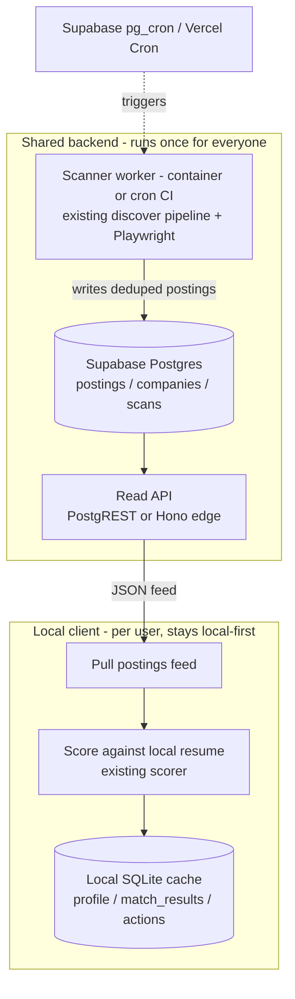

# Exploration: a shared sourcing backend (Vercel / Supabase)

> **Status: largely built (Phases 0.5–2 shipped).** This started as an exploration; the
> shared-read-feed v1 has since been implemented per
> [`docs/superpowers/plans/2026-06-27-hosted-scan-backend.md`](superpowers/plans/2026-06-27-hosted-scan-backend.md):
> the `runSourcing`/`ScanStore` split, the Supabase schema + RLS (live), `PostgresScanStore`, the
> `PostingFeed` client, hybrid remote mode, and the scanner worker are all on `main`. What remains is
> **operational** (scheduling the worker) and **Phase 3** (hosted multi-user). The original analysis
> below is kept for context — it maps the idea onto the code, weighs Supabase vs. Vercel, calls out
> the one real gotcha (Playwright doesn't fit serverless), and lays out the phased path.

## The redundancy we're trying to remove

A scan today (`runScan` in `src/cli/commands.ts`) is two phases with very different cost profiles:

1. **Sourcing (shared, identical for every user).** Read the stillhiring.today directory → resolve
   each careers URL to an ATS connector → fetch postings → liveness re-check the ones that vanished
   (`src/discovery/`, `src/freshness/`). This is the slow part: headless Chromium renders
   (`PlaywrightRenderer`), ATS API round-trips, and re-fetches, all bounded by a politeness delay
   and concurrency cap in `discover.ts`.
2. **Scoring (per-user, inherently personal).** Each posting is scored against *your* resume via the
   LLM (`deps.scorer.score`), writing `match_results`.

Phase 1 produces **the same postings for every user** — it's public data about who's hiring. Today
every install re-runs it independently, so N users means N identical crawls of the same boards: N×
the wall-clock, N× the load on those ATS boards, N× the Chromium cost. That's the redundancy.

**The core move:** run phase 1 once, centrally, on a schedule; publish a de-duplicated posting feed;
let each client skip straight to phase 2 against that feed. A user's "scan" stops being *crawl the
internet* and becomes *pull a JSON feed and score it* — seconds of fetch instead of minutes of
crawl, and zero duplicated crawling across the user base.

> **Enabling work in flight.** Decoupling these two phases into separate steps is being done
> independently (a parallel work thread is splitting `scan` and `score` so sourcing writes postings
> and scoring reads them, rather than interleaving in one pass). That decoupling is the precondition
> for everything below — once `score` reads postings from the store instead of from an in-process
> crawl, pointing it at a *remote* feed becomes a source swap rather than a redesign. The rest of
> this doc assumes that split has landed (see "A phased path → Phase 0.5").

## What's shared vs. per-user (the data split)

The current SQLite schema (`src/storage/schema.ts`) splits cleanly along this seam:

| Table | Nature | Where it lives in the new model |
| --- | --- | --- |
| `postings` | public | **Shared** — written by the central scanner |
| `companies` | public | **Shared** — directory snapshot |
| `scans` | public | **Shared** — scan bookkeeping/diffing |
| `skills` (dictionary) | public | **Shared** — seedable centrally |
| `profiles` | personal (resume) | **Per-user** — stays local, or RLS-scoped row |
| `match_results` | personal (your scores) | **Per-user** |
| `user_actions` (save/dismiss) | personal | **Per-user** |
| `tracked_companies` | personal | **Per-user** (see "tracked companies" below) |
| `settings` (API key) | personal/secret | **Per-user**, never centralized |

That clean split is what makes this tractable: the shared tables are exactly the public ones.

## The one real gotcha: the crawler needs a real runtime

The sourcing pipeline drives **headless Chromium via Playwright** (the Airtable shared-view reader
and the browser fallback connector). That does **not** fit a standard serverless function:

- Vercel/Supabase Edge functions can't ship or launch Chromium, and have short execution limits
  (seconds), while a full directory crawl runs for minutes.
- So "just deploy it to Vercel" doesn't work for the *crawler*. The DB and the API fit serverless
  fine; the crawl needs a **long-running container** (Fly.io / Railway / Render), a **scheduled CI
  job** (GitHub Actions on a cron), or a hosted browser service (Browserless/Bright Data) called
  from a worker.

This is the single most important constraint to design around: **split the scanner (container) from
the API + DB (serverless/managed).**

## Supabase vs. Vercel — who does what

They're complementary, not either/or:

**Supabase** — the natural home for the **data + API + per-user concerns**:
- **Postgres** replaces the SQLite tables; the schema ports almost directly (Postgres dialect).
- **Auto-generated REST/GraphQL API** (PostgREST) over those tables — a read-only postings feed with
  filtering/pagination for near-free, no handwritten endpoints.
- **Row Level Security** for the per-user tables (`profiles`, `match_results`, `user_actions`) if/when
  there are accounts.
- **Scheduled triggers** (`pg_cron` / scheduled Edge Functions) to *kick off* the periodic scan.
- **Realtime** so dashboards can live-update as new postings land.
- ✗ Can't run the Chromium crawl itself (Edge Functions are Deno, short-lived).

**Vercel** — the natural home for the **web dashboard + a thin API/edge layer**:
- Hosts the existing **React dashboard** (already a Vite build) trivially.
- The server is **Hono**, which runs on Vercel Edge/Node functions with a thin adapter — the existing
  `src/server/app.ts` routes could be reused rather than rewritten.
- **Vercel Cron** can trigger the scan on a schedule (calling out to the worker).
- ✗ No first-party database (Vercel Postgres is now Neon/marketplace) → pair with Supabase/Neon.
- ✗ Can't run the Chromium crawl (same serverless limits).

**Recommended shape:** **Supabase for Postgres + auto API + auth + cron**, a **containerized scanner
worker** (Fly.io/Railway, or a scheduled GitHub Action) running the *existing* `discover()` pipeline,
and **optionally Vercel** to host the dashboard + a thin edge API. If you'd rather not add Vercel,
Supabase alone covers DB + API + auth and the dashboard can keep being served by the app.

## Keeping the local-first privacy promise

The README's promise is that your resume never leaves your machine (except to Anthropic for
scoring). This redesign **can keep that intact** because the shared backend only ever handles
**public** data (postings/companies). Two options for scoring:

- **(Recommended) Score on the client.** The client pulls the public feed and runs the *existing*
  scorer locally against the local resume. The resume and your scores never touch the backend. This
  preserves the privacy story verbatim while still removing the crawl redundancy.
- **(Optional, hosted) Score on the server.** Requires uploading the resume — a different privacy
  posture. Only worth it for a fully hosted, zero-install product, and should be explicit opt-in.

The big win (kill the duplicated crawl) comes entirely from centralizing **sourcing** — scoring can
stay local, so we get the speed-up without weakening privacy.

## Where the current code already fits

This isn't a rewrite — the seams already exist, and the in-flight scan/score split widens the most
important one:

- **The decoupled `scan`/`score` steps** (landing in parallel) are the key seam. Today `runScan`
  (`src/cli/commands.ts`) interleaves discover → save → score in a single pass; once that's split so
  `score` reads postings from the store rather than from the just-finished crawl, the *only* thing
  Phase 2 changes is **where `score` reads postings from** (local SQLite → remote feed). No new
  coupling to unwind.
- **`discover()`** (`src/discovery/discover.ts`) is already a pure-ish pipeline taking injected
  `fetcher` / `renderer` / `sharedViewReader`. The scanner worker calls it as-is and writes results
  to Postgres instead of SQLite — it becomes the body of the standalone `scan` step, just pointed at
  a shared store.
- **`Repository`** (`src/storage/repository.ts`) is the single DB seam. A `PostgresRepository`
  implementing the same interface (or a thin remote-feed client) lets the client read shared postings
  with minimal churn — the decoupled `score` step wouldn't need to know whether postings came from a
  local crawl or a remote feed.
- **Incremental scan + expiry** (`scans`, `last_seen_scan`, `expired_at`) port directly to Postgres;
  the diffing logic is dialect-agnostic.
- **Hono server** (`src/server/app.ts`) already defines the API surface; the same routes can back a
  hosted read API.

### Two things to keep aligned across the threads

For the remote feed to drop in later without reworking the scoring step, the in-flight split should
preserve:

- **Stable posting identity.** `score` keys off `postings.id` (`src/discovery/posting-id.ts`). If the
  ID derivation stays identical whether a posting came from a local crawl or the shared feed, scores
  and `user_actions` stay attached across the source swap. Diverging IDs would orphan saved/dismissed
  state when a client moves to the feed.
- **`score` tolerating postings it didn't just fetch.** The decoupled step must handle postings that
  are already scored (re-score vs. skip) and ones that have since **expired** between scan and score —
  exactly the states a periodically-refreshed shared feed produces.

## A phased path

- **Phase 0 — today.** Local-first SQLite; each client crawls independently.
- ✅ **Phase 0.5 — decouple `scan` from `score`.** Done (free `scan` + budget-aware `score`). The
  precondition that turned Phases 1–2 into a source swap rather than a redesign.
- ✅ **Phase 1 — shared store + scheduled scanner.** Done: Supabase Postgres + RLS (live), the
  `PostgresScanStore`, the read-only PostgREST feed, and the `scan:worker` entrypoint + runbook.
- ✅ **Phase 2 — client reads the feed.** Done as **hybrid remote mode**: with `feedUrl`/`feedKey`
  set, the client pulls the feed instead of crawling the directory **and** still crawls its own
  tracked companies, scoring locally. (Tracked companies are kept local — option A — rather than
  dropped; submitting them to the cloud is the separate option B.)
- ⬜ **Phase 3 — optional hosted multi-user.** Accounts; move `profiles`/`match_results`/`user_actions`
  into Postgres behind RLS; optional server-side scoring. Only if a hosted product is the goal — not
  started.

Phases 0.5–2 (the entire speed + redundancy win) are shipped; what remains is **operational**
(scheduling the worker so the feed populates) and Phase 3, a separate product decision.

## Tradeoffs & risks

- **Ops cost replaces zero-ops.** Local-first is currently free and serverless-free. A shared backend
  means infra to run, monitor, and pay for (Supabase free-tier row/egress limits; worker hosting).
- **Crawler runtime.** As above — Playwright forces a container/cron worker; it won't fit pure
  serverless. Budget for that explicitly.
- **Tracked companies are personal.** A user's `tracked_companies` aren't in the shared directory.
  Either keep crawling those locally (small, fast) or let users contribute them to a shared pool
  (privacy + spam considerations).
- **Feed staleness.** The client trades "freshly crawled" for "as fresh as the last central scan."
  Centralized scanning can actually run *more often* than any individual would, but clients should
  treat the feed as stale-while-revalidate.
- **Politeness improves.** One central crawler is far gentler on ATS boards than N independent ones —
  a side benefit, and it consolidates the existing SSRF guard / rate limiting in one place.
- **Auth/multi-tenancy complexity.** Only incurred at Phase 3; RLS is the mechanism but adds surface
  area.

## Bottom line

The redundancy is duplicated **sourcing**, and sourcing is exactly the public, shareable half of the
pipeline. Centralize it — Supabase Postgres + auto API for the data, a container/cron worker for the
Playwright crawl, optionally Vercel for the dashboard/edge API — keep scoring on the client, and a
user's scan collapses from a multi-minute crawl to a feed pull. The in-flight `scan`/`score` split
(Phase 0.5) is the linchpin: once scoring reads postings from the store instead of an in-process
crawl, the existing `discover()` / `Repository` seams make Phases 1–2 a source swap, not a rewrite.
